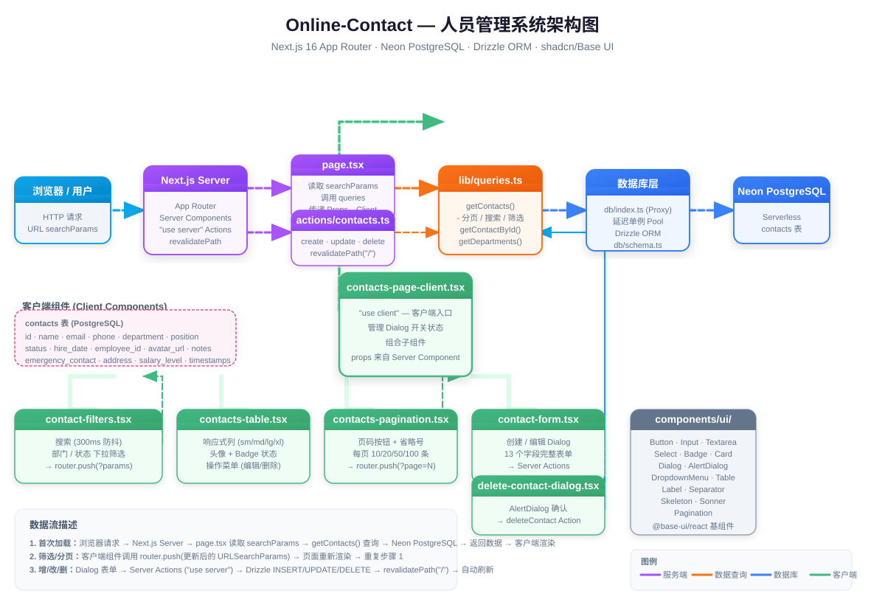

# Online-Contact — 人员管理系统

在线人员通讯录管理系统 / Online Personnel Contact Management System



## 技术栈 / Tech Stack

| 类别 | 技术 |
|------|------|
| 框架 | Next.js 16 (App Router, React 19, TypeScript) |
| 样式 | Tailwind CSS v4 + shadcn 设计令牌 + tw-animate-css |
| UI 组件 | @base-ui/react + class-variance-authority + lucide-react |
| 数据库 | PostgreSQL (Neon Serverless) + Drizzle ORM |
| 通知 | sonner |
| 字体 | Geist / Geist Mono |

## 模块结构 / Module Structure

| 模块 | 职责 |
|------|------|
| `src/app/page.tsx` | 服务端组件 — 读取 URL 参数，调用数据查询，传递 props 给客户端组件 |
| `src/app/actions/contacts.ts` | Server Actions — create/update/delete 操作，调用 revalidatePath 刷新 |
| `src/lib/queries.ts` | 数据库查询 — 分页列表、搜索筛选、单条查询、部门去重 |
| `src/lib/types.ts` | 类型定义 — Contact / NewContact 从 Drizzle schema 推断 |
| `src/lib/utils.ts` | 工具函数 — cn() (clsx + tailwind-merge) |
| `src/db/schema.ts` | 数据库表定义 — contacts 表 16 列 |
| `src/db/index.ts` | 数据库连接 — 延迟单例 Neon Pool (Proxy 模式) |
| `src/components/contacts-page-client.tsx` | 客户端入口 — 组合子组件、管理 Dialog 状态 |
| `src/components/contact-filters.tsx` | 筛选栏 — 搜索（300ms 防抖）、部门/状态下拉 |
| `src/components/contacts-table.tsx` | 数据表格 — 响应式列、头像、Badge 状态、操作菜单 |
| `src/components/contact-form.tsx` | 表单对话框 — 创建/编辑 13 字段表单 |
| `src/components/delete-contact-dialog.tsx` | 删除确认 — AlertDialog 调用 Server Action |
| `src/components/contacts-pagination.tsx` | 分页 — 页码导航 + 每页条数选择 (10/20/50/100) |
| `src/components/ui/` | 15 个 shadcn UI 基组件 (基于 @base-ui/react) |

## 数据流 / Data Flow

```
URL searchParams (search/department/status/page/pageSize)
  → Server Component (page.tsx) 读取参数
    → lib/queries.ts → Drizzle ORM → Neon PostgreSQL
    → Props 传递 → Client Component (contacts-page-client.tsx)
      ├── contact-filters → router.push(新 URLSearchParams) → 页面重新渲染
      ├── contacts-table → DropdownMenu → 编辑/删除
      ├── contacts-pagination → router.push(?page=N) → 页面重新渲染
      ├── contact-form → Server Actions → revalidatePath("/")
      └── delete-contact-dialog → Server Actions → revalidatePath("/")
```

所有状态管理通过 URL searchParams 实现，无需客户端 store。

## 快速开始 / Quick Start

```bash
# 安装依赖
pnpm install

# 配置环境变量
cp .env.example .env.local
# 编辑 .env.local 填入 DATABASE_URL

# 初始化数据库
pnpm db:init

# 填充测试数据（100 条随机联系人生成）
pnpm db:seed

# 启动开发服务器
pnpm dev
# 打开 http://localhost:3000
```

## 数据库命令 / DB Commands

```bash
pnpm db:generate   # 生成迁移文件
pnpm db:migrate    # 运行迁移
pnpm db:push       # 直接推送 schema 到数据库
pnpm db:studio     # 打开 Drizzle Studio (Web 管理界面)
pnpm db:init       # 初始化数据库表
pnpm db:seed       # 插入 100 条测试数据
pnpm db:reset      # 重置数据库
```

## API / Server Actions

| 方法 | 文件 | 说明 |
|------|------|------|
| `createContact(data)` | `src/app/actions/contacts.ts` | 添加新联系人 |
| `updateContact(id, data)` | `src/app/actions/contacts.ts` | 修改联系人信息 |
| `deleteContact(id)` | `src/app/actions/contacts.ts` | 删除联系人 |
| `getContacts(params)` | `src/lib/queries.ts` | 分页查询（支持 search/department/status 筛选） |
| `getContactById(id)` | `src/lib/queries.ts` | 按 ID 查询单条 |
| `getDepartments()` | `src/lib/queries.ts` | 获取所有不重复部门名称 |
